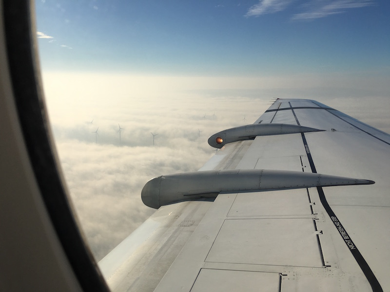

# A Foggy Flight-Plan

Going to Amsterdam for [Django Under The Hood][duth] should have been rather
straight forward. Hop on a plane to Vienna at *06:00*, then there onto one
headed to Amsterdam, and finally catch a train from Schiphol Airport to
Amsterdam Centraal at *09:30*. The conference even started at 13:00 so doing all
that on the first day of the event should have left me with nearly 4 hours to
spare and do things like buying a data SIM card.

Well, turns out that the old saying about plans and their first contact with the
battlefield still holds true. In this case you can replace "the battlefield"
with "fog". So the **tl;dr** version of this is: Always plan at least 12 hours
of buffer no matter where you want to go 😃

------------------

## The details

So what happened exactly? Long story, so I thought I'd simply put it into a
time-line for November 5, 2015:

<figure>
    
    <figcaption>
Find the ground
</figcaption>
</figure>

* I got up at *03:15* and took a taxi at *04:40* to Graz Airport.
* Flight to Vienna Airport lift-off at *06:05* (5 minutes delay).
* Flight reached Vienna but couldn't land due to extreme fog and was detoured to
  Linz.
* It wasn't really clear which way to go from here and after about an hour the
  plane left again for Vienna for a second try.
* *09:00*: This time it worked! So now I was in Vienna but nearly 2h too late so
  off I went to the next service station to get a new flight to Amsterdam. Turns
  out the next direct one would have been at around 3pm so I got booked onto one
  at 10:10 to Frankfurt with a connection to Amsterdam right afterwards. Planned
  arrival around 13:30. The whole [Austrian][aua] service desk was completely
  overloaded as all re-bookings are done manually.
* Flight to Frankfurt got delayed by 20min so I talked to a very friendly staff
  member at Gate F04. She couldn't help me either but suggested that it might
  still work out depending on which gate is assigned to the connecting flight in
  Frankfurt.
* Right after boarding the plane another 20min delay was announced. There was
  not the slightest chance anymore that I'd make my connection to Amsterdam.
* Plane took off to Frankfurt at around *11:05* (so nearly 55min after the
  scheduled departure time).
* *12:35*: I arrived in Frankfurt 15min after my connection to Amsterdam had
  left. "Hello, Service Desk" again.
* [Lufthansa][lh] had automatically re-booked me onto a flight leaving at
  *16:30*. Yey, 4 hours of sitting around at Fraport.
* I arrived in Amsterdam at 17:45 and left the terminal at *18:00*.
* Arrived at the hotel at *19:30*

Not bad: only 9 hours later than anticipated, a whole conference day missed and
after arriving at Amsterdam Centraal all of my friends already had had
dinner. Good times.

At least I saw more cities than expected. Instead of being in Graz, Vienna, and
Amsterdam, I also was in Linz and Frankfurt 😉

Things I've learnt:

* Lufthansa does automatic re-booking by default which you can then adjust. With
  [Austrian][aua] the whole process seems to be manual.
* The baggage reclamation hall at Schiphol no longer sells train tickets without
  chip cards.
* Sitting around a whole day at airports is extemely dull especially as the free
  WiFi at Fraport is restricted to a certain number of hours.
* Move somewhere with better flight-connections. This is really getting out of
  hand here.
* Walking from the west end of Amsterdam's inner city to the eastern one takes
  around 35 minutes.
* The iPhone 6S is adequat for taking pictures of fog from a plane.

[duth]: http://www.djangounderthehood.com
[aua]: http://www.austrian.com/
[lh]: http://www.lufthansa.com/
