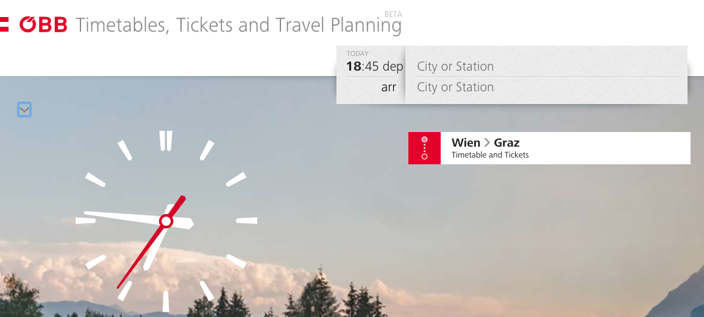

# ÖBB Beta and advertising

A couple of days ago I bought a train ticket to Vienna to visit some
friends. The [Austrian railway company](http://oebb.at) provides a rather easy
way to do that through their website and you can then pick up that ticket for
example with a mobile app that have been offering for many years now. Nothing
fancy but it gets the job done. Well, until now.

-------

For some reason they decided that they wanted something new and now launched a
new app under a new name and a completely overhauled design. It's actually
pretty nice but there are a couple of caveats. For example, you can't fetch the
tickets you bought on the main website with that new app, and the archive of
previously purchased tickets is actually extremely well hidden behind some
gestures on the app's home screen...

But probably the biggest issue for me was the way the ÖBB decided to advertise
this new "ÖBB App": By showing a banner in the old tickets app that overlayed
the lower 5th of the screen and thereby making the menu and the QR code that is
used for the ticket itself unusable. The only way I eventually managed to get
around this was by installing the advertised new application (which was still
considered to be a beta) and force-restart the old ticket app to get the full
usability back.

Looking through the reviews for the current version of the old "ÖBB Tickets" app
I'm not alone with these complains:

<figure></figure>

That new app is actually just one of the components of a bigger roll-out
including a new website, all of which is currently in
[beta](http://beta.oebb.at). A bit frightening here is that the
[new tickets website](https://tickets.oebb.at/) has the exact same usability as
the mobile app. Extremely simple and flashy but not intuitive.

<figure></figure>

Access to your ticket history is actually hidden between the tiny arrow above
the clock that I've highlighted in the screenshot.

I'm not sure why I need to have a huge clock using up about a quarter of the
screen on a laptop but anyway. And if you want to give feedback regarding that
new design, you have to log in. Not an issue per se, but it becomes one if you
have to use a totally different account from anywhere else on the site without
anybody telling you about that and why. "Feedback" is handled within
Wordpress comments for the
[respective blog posts](https://beta.oebb.at/feedback-fragen-zu-oebb-konto/)
instead of using something designed for that task 😦

In general it is a bit of a weird situation right now. I luckily could resolve
my original issue thanks to some force-restarting and the new app is "fine" but
feels a bit like a public beta.

I definitely don't envy the people behind this beta. The old tickets app is
probably something everyone who has a smartphone and uses trains has
installed. Building a replacement for that is not an easy job. I just wish that
it wouldn't all just look like a one-size-fits-all solution with the website and
the mobile app being more or less identical.

In any case I wish them luck (and budget) and really hope that the final product
will be great 😊 It looks like it's heading that way but simply isn't there
yet. Just please get a decent feedback system 😉

P.S.: This is just a more verbose version of a piece of feedback I've already
submitted to the Beta team.
