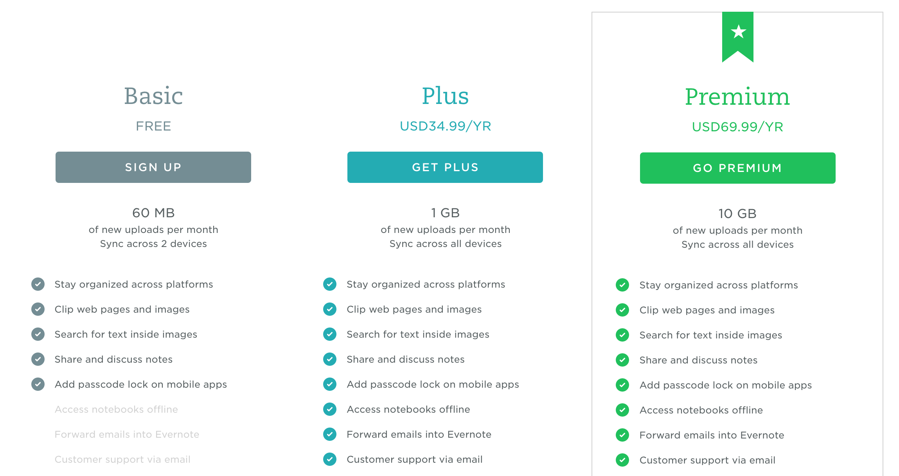

# Evernote pricing changes

A couple of days ago, Evernote [announced][ann] that they'd change pricing for
their Plus and Premium plans and introduce a limit of devices you can sync with
using the (free) Basic plan. As was to be expected, this has led to an
[outcry][forum] of some of its users. And I can sympathise. I've used EN since
2008 and also paid for their Premium package for some of these years but these
changes worry me.

-----

Earlier this year I looked through my monthly and yearly subscriptions searching
for something to cut (they were slightly getting out of hand). At that time I
hadn't used Evernote that heavily anymore and thought I might jump back to Basic
until I use it again. I had never even come close to reaching the monthly upload
limit on Premium (or even on Basic, actually) and while I enjoyed some of the
new features, I could definitely live without them for the time being.

And then the announcement of the price increase and feature-set change
happened. First: The shift in Basic features. Probably the biggest here is that
you can no longer synchronise unlimited devices on the free tier. Instead, a
limit has been set at two devices, which looks fair and should be a good
motivator for people with more devices to update to an affordable new tier. The
old $25 USD Plus plan was perfect for that, but that has been raised to $35 USD.

<figure>

<figcaption>
The new <a href="https://evernote.com/pricing/">pricing</a>
</figcaption>
</figure>

I, originally, wanted (1) the OCR features and (2) support the platform so I
went for the Premium plan a couple of years ago. At $45 USD I could definitely
live with that. But that has changed too. The new price for the top tier is $70
USD?  ... wait, what?! That's basically than old price + the old Plus plan
combined!

That's bad, but surely they have tons of new features to justify that, right?
Well, the Passcode Lock has been moved from the Plus to the Basic tier
([compare](https://web.archive.org/web/20160617191853/https://evernote.com/pricing/))
but that's pretty much it. The announcement also contains this:

> We’ve begun rolling out improvements to the note editing experience, with more
> updates coming later this year.

So no actually new feature at this time. And about the existing improvements:
Personally, I didn't notice any of them. The editor is still the bare minimum
you should be able to expect. There is still no way to use a consistent style
within your note. Even something simple as a customizable "heading" style a
consistent quoting would make me re-evaluate EN. That has been requested by tons
of people tons of times. Nothing.

But that's not the only thing. The core features haven't changed in any
meaningful way ever since I started using Evernote in 2008. Conflict resolution
after concurrent edits still does exist only barely, note templates (like the
ones used by apps like EN Hello) are still limited to application providers... I
can only think of two features that were heavily requested by the community that
eventually made their way into the app: Reminders and the presentation mode
which is locked behind the Premium tier. 2FA was also introduced after many,
many years of waiting but that's more a basic requirement for a service like
Evernote than anything else.

What *has* been added are things like LinkedIn integration, Google Drive
integration (Why?! The whole point of EN is to have your memory in one place and
indexed!) and the "Context" feature, that basically pollutes the built-in search
feature with indexes from outside partners... Again nothing that actually
improves the core note-taking features.

Don't get me wrong, if the core features worked mostly fine, it would be a nice
package. Sadly, quite often they don't or get in your way. The point has come
where I simply don't believe anymore that any real change to the app and service
will actually come. Combine this with a non-trivial increase in subscription
fees and I can't even recommend the service anymore. If the increase had been
like $5 USD on the yearly plans and the core features saw some love, this would
have been a completely different blog post.

I hope that Evernote will finally start to evolve again after these many years
of stagnation and that I will get a chance to re-evaluate my opinion here, but
I'm not holding my breath right now.

[ann]: https://blog.evernote.com/blog/2016/06/28/changes-to-evernotes-pricing-plans/
[forum]: https://discussion.evernote.com/topic/97236-changes-to-evernote%E2%80%99s-pricing-plans/
